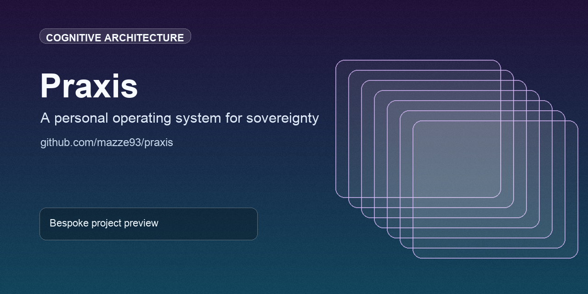

# Praxis

Praxis is a coordinated system for identity sovereignty: operational context, cognitive continuity, and community-safe infrastructure working as one stack.

## At a glance
- Define a coherent operating model for privacy, cognition, and trust.
- Compose DAEDALUS, ContextSynapse, Secure Pride, and Aegis layers.
- Prioritize accessibility, local ownership, and operational resilience.

## Quick links
- [What Praxis Is](#what-praxis-is)
- [Design Principles](#design-principles)
- [Architecture](#architecture)

## GitHub social preview
Upload `.github/social-preview.png` in repository `Settings -> General -> Social preview` to use the branded card on link shares.

## What Praxis Is

A layered system of interdependent components, each solving one part of the sovereignty problem:

| Layer | Component | What it owns |
|-------|-----------|-------------|
| Identity | [DAEDALUS](https://github.com/mazze93/daedalus) | *Who* you are in a given context — operationally, securely |
| Cognitive | [ContextSynapse](https://github.com/mazze93/context-synapse) | *What you know and remember* — adaptively, locally |
| Community | [Secure Pride](https://github.com/mazze93/Secure-Pride) | Proving the system works for those who need it most |
| Infrastructure | Templates, [Aegis Icons](https://github.com/mazze93/secure-pride-aegis-icons) | Reusable primitives so the system can be built on safely |
| Voice | [mazze-leczzare-blog](https://github.com/mazze93/mazze-leczzare-blog) | How the system and its philosophy speak outward |

These are not separate projects. They are components of a single operating system for the self.

---

## Design Principles

**1. Local-first is non-negotiable.**
Your cognitive substrate lives on your hardware. No required cloud dependency. No third-party custody of your context.

**2. Privacy is the architecture, not a feature.**
Every component is built privacy-first at the structural level. It cannot be bolted on afterward.

**3. Cognitive accessibility is a first-class requirement.**
ADHD-accessible design throughout. One command, not ten steps. Minimal decision overhead. Context that follows you instead of requiring you to reconstruct it.

**4. Sovereignty requires composability.**
The layers must integrate. Switching identity context (DAEDALUS) should carry cognitive context (ContextSynapse). Components that don't talk to each other leave gaps that surveillance fills.

**5. The personal is political.**
Praxis exists because people's lives depend on it. Secure Pride is the proof of concept. The system is built with the communities most endangered by its absence.

---

## Status

Praxis is an emerging system. The components exist and function independently. The integration layer — the connective tissue that makes them a unified OS — is the next frontier.

See [ARCHITECTURE.md](./ARCHITECTURE.md) for the technical map.
